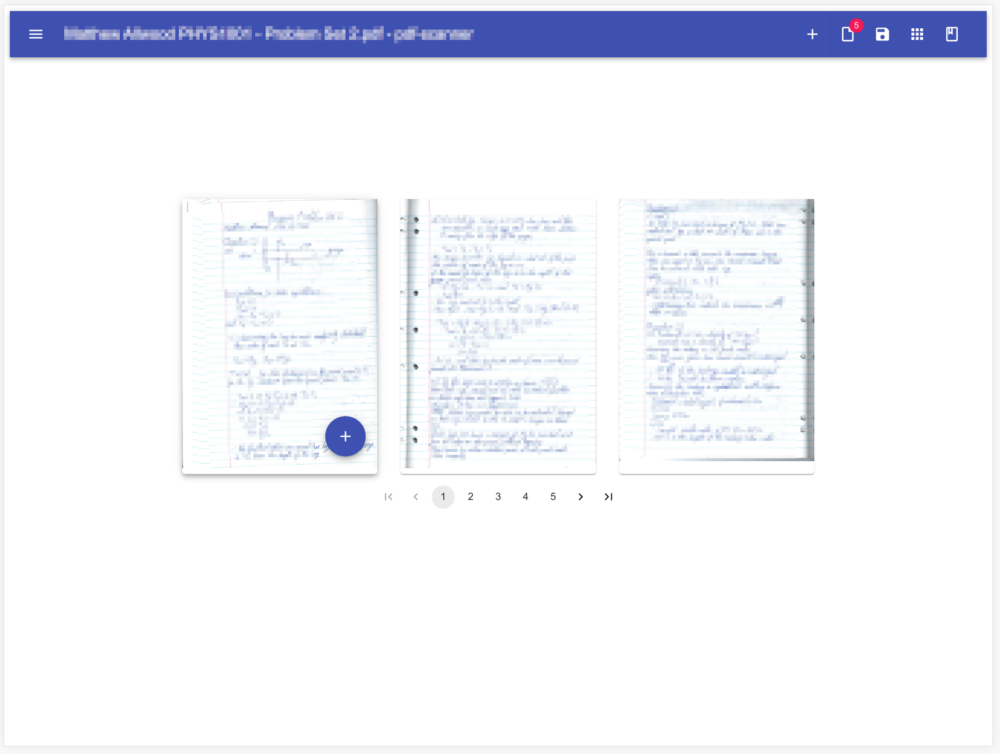
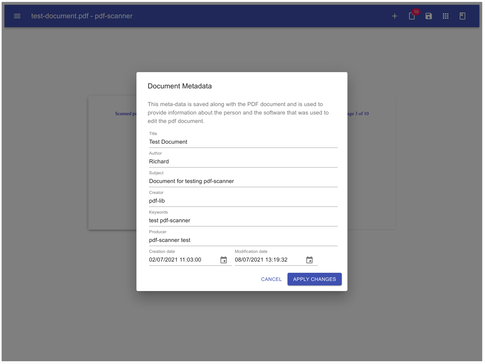

# pdf-scanner

This project is a simple react application that can be used to process scanned PDF images.

Its primary purpose is to:
- Allow pages to be added/removed
- Rotate pages
- Enter PDF metadata about the document

The application runs as a Single Page Application (SPA) that performs all PDF processing on the client web browser.

## Development libraries

### pdf-lib
https://github.com/Hopding/pdf-lib

## Getting started

The following commands are available:

### `yarn start`

Runs the application is development mode. The web application should be opened automatically or can be viewed
on [http://localhost:3000](http://localhost:3000)

### `yarn test`

Run the application tests

### `yarn build`

Builds the app for production in the `build` folder.

### `yarn storybook`

Runs the storybook application for testing the application components.
